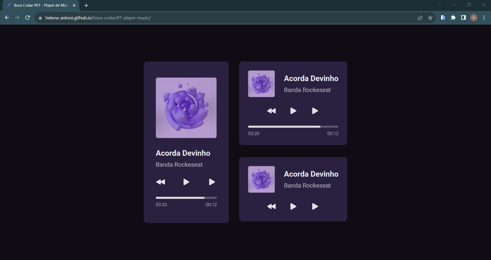
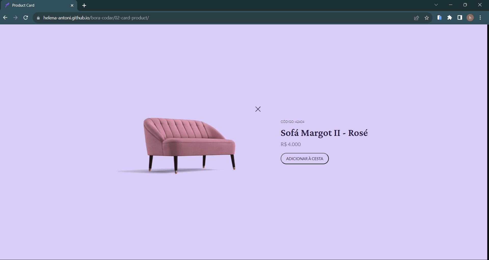

# boracodar

Projetos #boraCodar da Rocketseat

[Acesse aos Desafios clicando aqui](https://boracodar.dev)

 <table>
      <thead>
        <tr>
          <th>#</th>
          <th>Nome</th>
          <th>Data</th>
          <th>Visualização</th>
        </tr>
      </thead>
      <tbody>
        <tr>
          <td>01</td>
          <td>Music Player</td>
          <td>13/11/2023</td>
          <td> </td> 
          <td><a target="_blank" href="https://helena-antoni.github.io/bora-codar/01-player-music/">🔗</a></td>
          <td>📎</td>
        </tr>
        <tr>
          <td>02</td>
          <td>Product Card</td>
          <td>15/11/2023</td>
          <td> </td> 
          <td><a href="https://helena-antoni.github.io/bora-codar/02-card-product/">🔗</a></td>
        </tr>
      </tbody>
    </table>
